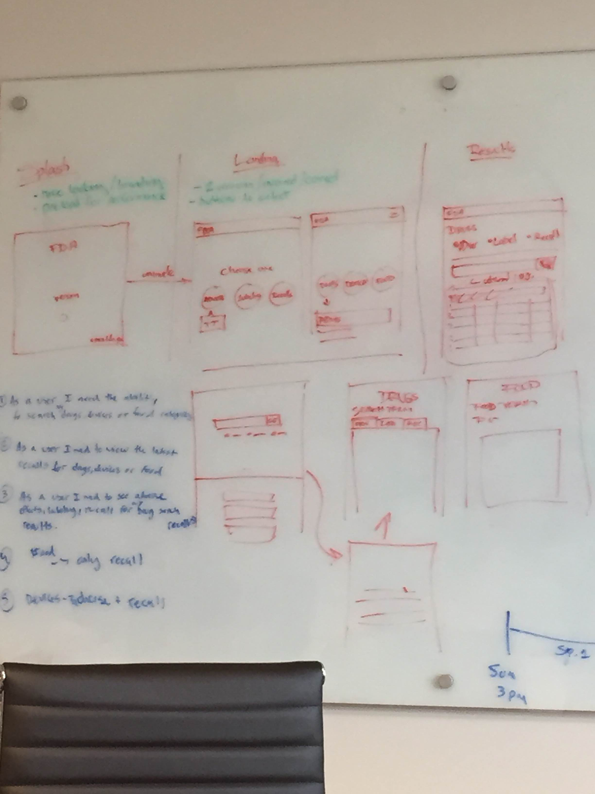

# What is FDA-GO?

FDA-GO is Concept Plus' design prototype submission in response to the 18F BPA for Agile Delivery Services. 

Project Links  | URLs 
 ------------- | ------------- 
 Working Protoype    | [http://fdago-design.conceptplusllc.net](http://fdago-design.conceptplusllc.net) 
 Mock Prototype    | [http://invis.io/G23ERJCMY](http://invis.io/G23ERJCMY) 
 Design Style Guide   | [http://fdago-styleguide.conceptplusllc.net/](http://fdago-styleguide.conceptplusllc.net/)

#### Powered By

# Team

Upon receipt of the RFQ, Yazan Ramahi was appointed and authorized to put a multidisciplinary team together to collaboratively design, develop, and deploy a working protoype.

Team members consisted of:
* **Product Manager:** (Category 1) - Yazan Ramahi- Leader given authority, responsibility, and held accountable for the quality of the FDAGO prototype.
* **Interaction Designer/User Researcher/Usability Tester:** (Cateogry 3) - Erica Jeffery 
* **Visual Designer:** (Cateogry 4) - Melanie Logan
* **Frontend Web Developer:** (Category 6) - Ponnamy Kiep

# Human Centered Design Techniques

## Participatory Design

The Concept Plus team held a workshop with "people" and worked together to design the initial FDA-GO prototype.  During the workshop the team presented initial design ideas to "people" during a whiteboard session and "people" were asked for feedback and recommendations.   Throughout the workshop the design was refined and initial designs were accepted by both "people" and the team.

## Interviews

Interviews were conducted with "people" at least two times throughout the life of the project.  "People" were interviewed individually by the interaction designer and were asked to answer specific questions the team had put together.  Feedback from interviews were captured through reports and used to enhance user experience.

## Iterative User Interface Design

The user interface design was developed through an iterative approach.  The initial design was developed during the participatory design workshop. Paper wireframes were then created and "people" were asked to complete a series of tasks and provide feedback as well as accessing an interactive clickable prototype.  The final mock-ups were developed to enhance  the look and feel based on participant feedback captured during the wireframe and clickable prototype interviews.

# Design Style Guide

To establish and retain the branding for FDA-GO a design style guide was created to ensure that branding assets and guidelines are followed. See the [FDA-GO Design Style Guide ](http://fdago-styleguide.conceptplusllc.net/) for complete details.

# Usability Testing

The goal of the usability tests was to assess overall usability of FDA Go during the design phase.  The product team was interested in learning whether users could navigate the web-based application and understand the general workflow and content of the site. 

## Usability Test Methodology

* Conduct two rounds of usability testing 
* Conduct Design Round 1 testing utilizing paper wireframes of initial designs 
* Conduct Design Round 2 testing utilizing a clickable proto-type
* Collect participant feedback and provide recommendations to enhance user experience 
* Three individuals participated in a usability test of FDA Go
* Participants performed a series of 8 tasks and provided feedback

## What Participants Did

Participants were interviewed and observed during design phase round one testing and completed a series of seven tasks.  During round one testing, participants were asked to complete tasks in a hypothetical manner using paper wireframes and provide additional feedback and observations.

The same participants were used during round two, however they were provided with a link to an interactive clickable proto-type and asked to complete the questionnaire and provide feedback and observations.

## What Data We Collected

Data collected includes the paths participants used to complete tasks, paths selected, task completion rates, and verbal feedback.  [Click here to see all test scenarios used and results](./Usability).

# Technologies

Keeping in mind the short timeframe, we created a prototype that worked on multiple devices while satisfying all of the criterias for this challenge. The FDA-GO application will consume the [OpenFDA APIs](http://open.fda.gov). This was achieved with using many modern and open source technologies.

## Modern, Open Source Technologies

* **[NodeJS](http://nodejs.org)** - Cross-platform runtime environment
* **[AngularJS](https://angularjs.org/)** - Front-end framework
* **[Bootstrap](http://getbootstrap.com)** - Front-end UI framework
* **[Datatables.net](http://www.datatables.net)** - Advanced jQuery tables
* **[GruntJS](http://gruntjs.com)** - Javascript task runner
* **[Jasny Bootstrap](http://www.jasny.net/bootstrap/)** - Enhanced Bootstrap utilities
* **[Yeoman](http://yeoman.io/)** - Enhanced Bootstrap utilities

# FDA-GO Local Installation

_See the [FDA-GO Local Deployment Guide](./LOCAL_INSTALLATION.md)_

# License

FDA-GO is licensed under the MIT license. For full details see the [LICENSE](./LICENSE.md) on github.
